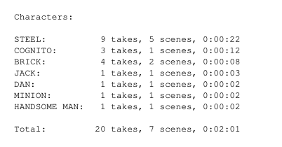
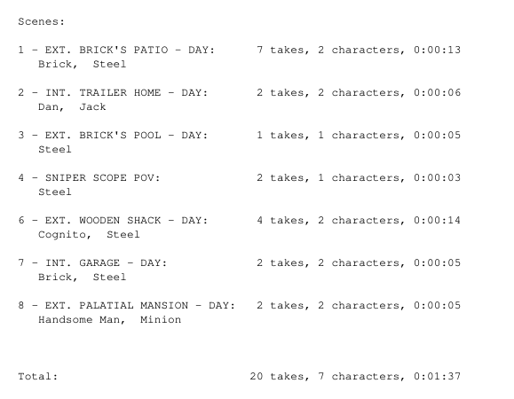
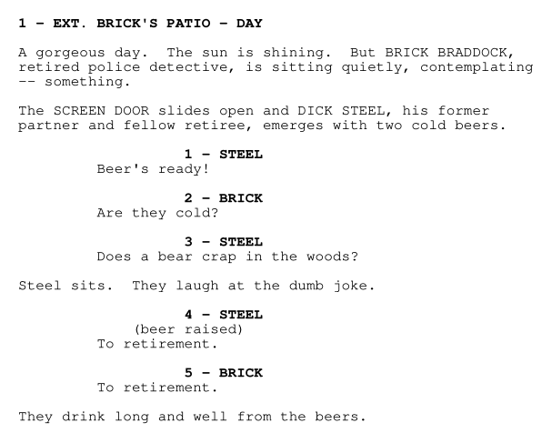
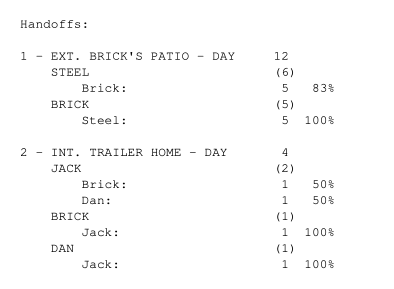
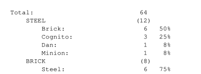

# Screenfancy

A wrapper script on top of [screenplain](https://github.com/vilcans/screenplain) to adjust some formatting and add fancy statistics

## Formatting adjustments

- Numbered takes
- Numbered scenes

## Statistics

- **Character list**
  After the title page, a list of every character in the script is shown, along with their take count, how many scenes they appear in and approximated speaking time.
- **Scenes list**
  The next page does the same for scenes: Take count, number of characters and approximated length
- **Handoffs**
  At the end, after the script and separated by a blank page, the interactions between characters are listed. This is how many times a character has their take before or after a specific character.
  This is especially useful if you have a hobby of spontaneously voice acting scripts with a number of people, each voicing multiple characters, and need to figure out which ones to take in order to minimize having a full dialog with yourself.

